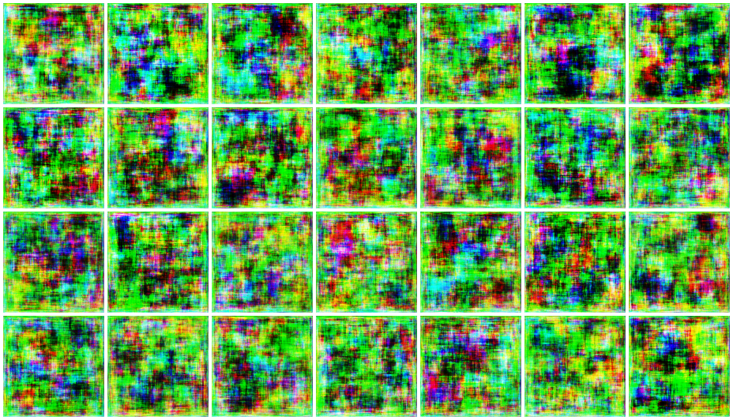
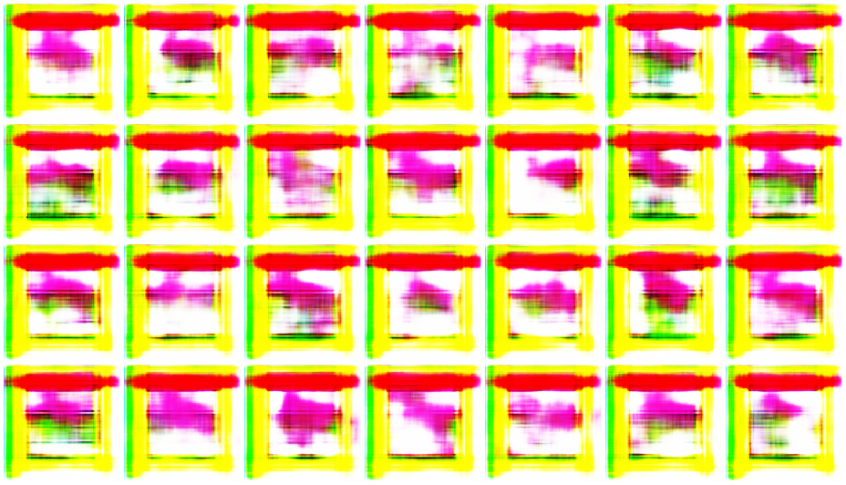

# TheBeautyOfBelonging
This project inspired from traditional Saudi architecture arts. out dataset is collection of digital illustrations created by [Nourah Alashwali](https://www.instagram.com/noura_alashwali/). .
The deep learining model we use Generative Adversarial Network (GAN) using Keras — A Deep Learning Library.

The result of first epoch :

The result after 10,000 epoch :

