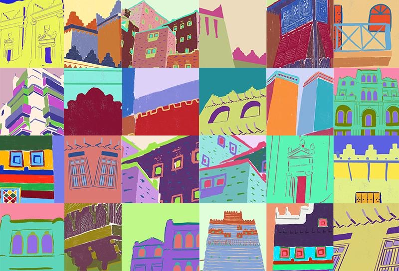
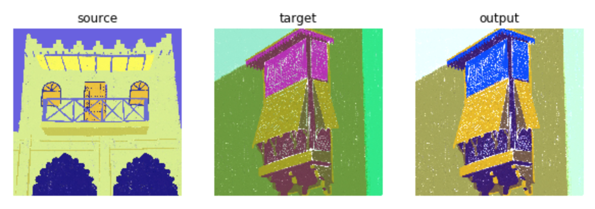
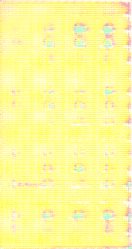

# WGAN-Saudi Heritage Archicture Art


## Project Overview

 This project inspired from Heritage architecture from 13 regions of Saudi arabie .It's part of [Artathon Competion](https://www.theglobalaisummit.com). The deep learning model  we used is  modified version of [Erik Linder-Norén PyTorch implementation](https://github.com/eriklindernoren/PyTorch-GAN/blob/master/implementations/wgan_gp) of  Wasserstein GAN [WGAN-GP](https://arxiv.org/pdf/1704.00028.pdf) . Our model can generate rectangle images with size ( 480x270 )  . Our dataset is collection of digital illustrations created by [Nourah Alashwali](https://www.instagram.com/noura_alashwali/) . 
 



 Since our dataset wes small ( 114 paintings  ) we use many augmentation techniques to increase the diversity of data available for training models . one of them is   [The Color Transfer Algorithm](https://www.pyimagesearch.com/2014/06/30/super-fast-color-transfer-images/) 
 
 
 
  The pre-trained model is included you can download it from Model folder in this repo . Below are some of examples of what it can generate . Don't sell the outputs of the pre-trained models .
  
 
 
we also use  interpolation and vector arithmetic to explore the GAN Latent Space 


 
 Finally to present artwork video to 4D screen we use [pretraind wights](https://github.com/krasserm/super-resolution) to increase resolution of video from (480x270 ) to (1920x1080) pixel . 
 
 
 

## Project Instructions

1. Clone the repository and navigate to the downloaded folder.
	
	```	
    git clone https://github.com/bdourE/TheBeautyOfBelonging
	```
2. Download the [Saudi Heritage Archicture dataset](https://drive.google.com/open?id=1VNvM5xlqKkJr1-T7mI1jaF3m6f_sO5jR).  Unzip the folder and place it in the repo, at folder Dataset .  

3. Make sure you have already installed the necessary Python packages according to the requirment.txt in repository.

4. Open a terminal window and navigate to the project folder. use the following command to get generative artwork . generated atwork save in results folder.
	
	```
    python generateArtwork.py
	```
    
5. if you like to create video of latent spece interpolotion , use the following command .
    
    ```
    python latentSpace.py
    ```
    
6. if you want to make exta training .

    ```
    python train.py
    ```
    
7. you can also use function to increase the generated animation to increase reslution to 4D .
    
    ```
    python 4d_converter.py -videoDir Results/animation.mp4
    ```


## (Optionally) Accelerating the Training Process 

If your code is taking too long to run, you will need to switch to running your code on a GPU.  If you'd like to use a GPU, you can use [spell](https://web.spell.run/refer/bdour)


##  Contact me 

*  email: b.e_91@yahoo.com

*  LinkedIn: [Bdour Ebrahim](https://www.linkedin.com/in/bdour-ebrahim-682b17145/)
